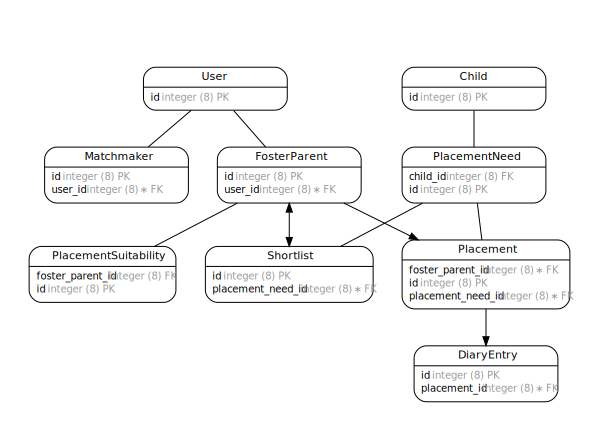

## ChildrensSocialCarePlacement

## ERD

This is the simplified view of the current data model, generated automatically from ActiveRecord.



To re-generate and commit new version after schema change:

```bash
bundle exec erd --attributes=primary_keys,foreign_keys,inheritance --filetype=svg --title=""
```

## Prerequisites

- Ruby 2.7.2
- PostgreSQL
- NodeJS 14.5.x
- Yarn 1.22.x

## Setting up the app in development

1. Run `bundle install` to install the gem dependencies
2. Run `yarn` to install node dependencies
3. Run `bin/rails db:setup` to set up the database development and test schemas, and seed with test data
4. Run `bundle exec rails server` to launch the app on http://localhost:3000
5. Run `./bin/webpack-dev-server` in a separate shell for faster compilation of assets

## Whats included in this boilerplate?

- Rails 6.1 with Webpacker
- [GOV.UK Frontend](https://github.com/alphagov/govuk-frontend)
- RSpec
- Dotenv (managing environment variables)

## Running specs, linter(without auto correct) and annotate models and serializers
```
bundle exec rake
```

## Running specs
```
bundle exec rspec
```

## Linting

It's best to lint just your app directories and not those belonging to the framework, e.g.

```bash
bundle exec rubocop app config db lib spec Gemfile --format clang -a

or

bundle exec scss-lint app/webpacker/styles
```

## Deploying on GOV.UK PaaS

### Prerequisites

- Your department, agency or team has a GOV.UK PaaS account
- You have a personal account granted by your organisation manager
- You have downloaded and installed the [Cloud Foundry CLI](https://github.com/cloudfoundry/cli#downloads) for your platform

### Deploy

1. Run `cf login -a api.london.cloud.service.gov.uk -u USERNAME`, `USERNAME` is your personal GOV.UK PaaS account email address
2. Run `bundle package --all` to vendor ruby dependencies
3. Run `yarn` to vendor node dependencies
4. Run `bundle exec rails webpacker:compile` to compile assets
5. Run `cf push` to push the app to Cloud Foundry Application Runtime

Check the file `manifest.yml` for customisation of name (you may need to change it as there could be a conflict on that name), buildpacks and eventual services (PostgreSQL needs to be [set up](https://docs.cloud.service.gov.uk/deploying_services/postgresql/)).

The app should be available at https://childrens-social-care-placement.london.cloudapps.digital

### Required environment variables

As per the `config/settings.yml` file, there are few variables which need to be set in each environment:

* `SETTINGS__HOST`: The actual full url of the app to be prepended to url routes.
* `SETTINGS__NOTIFY__API_KEY`: API key to allow sending via Gov.uk Notify
* `SETTINGS__NOTIFY__VIEW_TEMPLATE_ID`: Template ID from Gov.uk Notify which supports using Rails templates

## github workflow

There is an open issue referenced here: https://www.pivotaltracker.com/n/projects/2196383/stories/173541786
As a work around, .cfignore file is updated to include /node_modules/.cache/*

## rails console on CloudFoundry

1. SSH into the app as a Space Developer
  `cf ssh <APP_NAME>`
2. Enter the following:
  `cd /<WORKDIR>`
  `/usr/local/bin/bundle exec rails console`

## Rake commands on CloudFoundry

1. Access rails console as above
2. Enter the following:
  `require 'rake'`
  `Rails.application.load_tasks`
  `Rake::Task['task_name'].invoke`

  just a change
